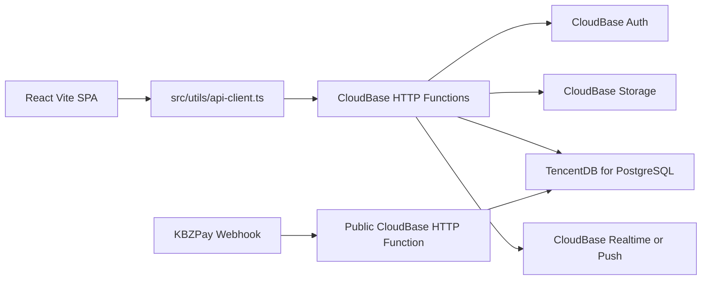

# Full Tencent Migration Plan

## Target Architecture

Use a Tencent-only backend while preserving the app's existing API surface during migration:

## Migration Approach

- Replace Supabase project binding in [`utils/supabase/info.tsx`](utils/supabase/info.tsx) with a Tencent/CloudBase config module, sourced from `VITE_CLOUDBASE_ENV_ID`, region, API base URL, and publishable key where needed.
- Keep the frontend API contract mostly stable by changing [`src/utils/api-client.ts`](src/utils/api-client.ts) to call CloudBase HTTP Functions instead of `https://{projectId}.supabase.co/functions/v1/make-server-16010b6f`.
- Port the Hono backend from [`supabase/functions/make-server-16010b6f/index.tsx`](supabase/functions/make-server-16010b6f/index.tsx) into a Node-compatible CloudBase HTTP Function package. Remove Deno/npm/jsr imports and introduce `@cloudbase/node-sdk` plus TencentDB access.
- Port [`supabase/functions/kpay-webhook/index.ts`](supabase/functions/kpay-webhook/index.ts) to a public CloudBase HTTP Function with the current KBZPay signature verification preserved.
- Migrate the current `kv_store_16010b6f` document source of truth and SQL read-model tables from [`supabase/migrations`](supabase/migrations) into TencentDB for PostgreSQL first. This keeps JSONB, indexes, pagination, and RPC-equivalent behavior practical without rewriting the whole app into a different query model.
- Replace Supabase Auth usage in [`src/app/contexts/AuthContext.tsx`](src/app/contexts/AuthContext.tsx) and server auth helpers with CloudBase Auth or a Tencent-backed custom session layer, then migrate existing users with a forced password reset or controlled credential migration depending on what credentials can legally/exportably be moved.
- Replace Supabase Storage calls in backend helpers like [`supabase/functions/make-server-16010b6f/storage_bucket_helpers.tsx`](supabase/functions/make-server-16010b6f/storage_bucket_helpers.tsx) and [`supabase/functions/make-server-16010b6f/storage_delete_helpers.tsx`](supabase/functions/make-server-16010b6f/storage_delete_helpers.tsx) with CloudBase Storage signed URL/upload/delete APIs.
- Replace Supabase Realtime channels in [`src/app/components/OrderRealtimeBridge.tsx`](src/app/components/OrderRealtimeBridge.tsx), [`src/app/utils/chatRealtime.ts`](src/app/utils/chatRealtime.ts), [`src/app/utils/ordersRealtime.ts`](src/app/utils/ordersRealtime.ts), checkout payment status, cart sync, and wishlist sync with CloudBase Realtime/Push or SSE/WebSocket functions, retaining HTTP polling fallbacks where already present.
- Update deployment scripts in [`package.json`](package.json), docs, and `.env.example` from Supabase CLI commands to CloudBase/Tencent deployment commands and required environment variables.

## Phases

1. Inventory and adapter layer: create Tencent config/API/storage/realtime/auth adapter boundaries while preserving existing component behavior.
2. Backend port: move the Hono API and KBZPay webhook to CloudBase HTTP Functions and make them run locally against Tencent-compatible services.
3. Data migration: export Supabase KV/read-model data, import into TencentDB for PostgreSQL, recreate indexes/functions as SQL or app-layer queries, and add validation scripts equivalent to `validate:read-model`.
4. Frontend cutover: point API/auth/storage/realtime integrations to Tencent adapters and remove direct Supabase client usage.
5. Verification: run build/tests, validate core flows: vendor storefront, admin/vendor login, products, orders, checkout, KBZPay webhook/return, storage uploads, chat, cart/wishlist sync, and read-model counts.
6. Decommission: remove Supabase dependencies, scripts, secrets, docs, and runtime references only after Tencent production validation passes.

## Key Risk Decisions

- The recommended “fully Tencent” path still uses TencentDB for PostgreSQL, not Supabase Postgres. This avoids a risky rewrite of JSONB queries, SQL read models, indexes, and RPC-heavy admin pagination into CloudBase NoSQL all at once.
- CloudBase Auth may not accept direct import of Supabase password hashes in a usable form. Plan for password reset or a temporary migration login flow.
- Realtime behavior is the most likely area to need product-level acceptance because Supabase Postgres changes, broadcast channels, and CloudBase push/watch semantics are not identical.
- Image transformation URLs currently rely on Supabase Storage behavior; CloudBase Storage/COS may need either original uploads, CDN image processing, or server-generated thumbnails.
